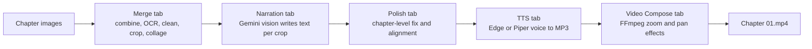

<div align="center">

# comic-to-video-pipeline

**Turn chapter images into narrated 1080p videos, from one desktop app.**
Image cleanup → AI narration → text-to-speech → video rendering.


</div>

---

## In plain words

You give the app a folder of chapter images. It:

1. cleans and cuts the images into panels,
2. asks an AI model to write a short narration for each panel,
3. turns the narration into speech,
4. builds a video where each panel shows on screen for exactly as long as its narration lasts.

Normally these steps need four or five separate tools and a lot of copy-and-paste between folders. This project keeps them in one window and passes each step's output to the next one.

It is free, open source, and runs on your own computer. **You bring your own API keys. No keys are included or stored in this repository.**

## Pipeline



## Features

- **Batch processing.** Point it at a root folder that holds many chapters. It processes them one after another.
- **Image preparation.** Combine pages into long strips, run OCR, remove text with inpainting, detect and crop panels, and build collage pages.
- **AI narration with context.** Each panel is sent to Gemini together with the text of the previous and next panels, so the story flows.
- **Key rotation.** Add several Gemini keys. The app switches key when one hits a rate limit, and drops a key that keeps failing (401/403).
- **Safe polishing.** The Polish step makes one API call per chapter, retries up to 3 times, and never overwrites files unless the whole chapter succeeds.
- **Three voice options.** Edge TTS (online, no key), Piper (fully offline). See the note on Murf below.
- **Resume-friendly.** TTS skips MP3 files that already exist, so you can stop and restart.
- **Video effects.** Zoom-in, zoom-out, pan-down, and pan-up on a blurred background. Output is 1920×1080 at 30 fps.
- **Responsive UI.** Work runs in background threads, so the window does not freeze.

## Requirements

### Software

| Tool | Needed for | Required? |
|---|---|---|
| Python 3.10 or newer | Running the app | Yes |
| [FFmpeg](https://ffmpeg.org/download.html) and `ffprobe` on your `PATH` | Audio conversion, video rendering | Yes |
| [Tesseract OCR](https://github.com/tesseract-ocr/tesseract) | The **OCR** and **Remove Text** steps | Only if you use those steps |
| [Piper](https://github.com/rhasspy/piper) and a voice model | Offline TTS | Only if you choose the Piper voice |
| Internet connection | Gemini API, Edge TTS | Yes (except Piper-only TTS) |

On Linux you may also need Tk: `sudo apt install python3-tk`.

### Accounts and keys (bring your own)

| Service | What you need | Where to enter it | Cost |
|---|---|---|---|
| Google Gemini | One or more API keys from [Google AI Studio](https://aistudio.google.com/app/apikey) | **Narration** tab and **Polish** tab. One key per line, or comma-separated. | Free tier available. Check current limits. |
| Edge TTS | Nothing | Pick **Edge** in the TTS tab and type a voice name such as `en-US-GuyNeural` | Free |
| Piper | Voice files (`.onnx` and `.onnx.json`) | See the Piper setup below | Free |

Optional environment variables (used by the OCR-based narration expansion in the Merge step):

```bash
# Windows PowerShell
$env:GEMINI_KEYS = "key1,key2,key3"
# macOS / Linux
export GEMINI_KEYS="key1,key2,key3"
```

`GEMINI_API_KEY` (a single key) also works. If neither is set, that step falls back to the text it already has.

> **Never commit your keys.** Keep them in the app fields or in your shell environment only.

## Install

```bash
git clone https://github.com/saumitratambe/comic-to-video-pipeline.git
cd comic-to-video-pipeline
python -m venv .venv
# Windows:  .venv\Scripts\activate
# macOS/Linux:  source .venv/bin/activate
pip install -r requirements.txt
python main.py
```

### Piper setup (optional, offline voice)

1. Download Piper for your OS and unzip it into a folder named `piper` **next to `tts_logic.py`**.
2. Put at least one voice (`<name>.onnx` and `<name>.onnx.json`) inside that folder.
3. Restart the app. The voice shows up in the **Piper Voice** list.

## Folder layout

Start with a **root folder** where every sub-folder is one chapter, filled with page images:

```text
my-series/
├── Chapter 01/   page1.jpg page2.jpg ...
├── Chapter 02/   ...
└── Chapter 03/   ...
```

The Merge step creates the working folders inside each chapter. By the end you will have:

```text
Chapter 01/
├── Combine/        stitched pages          (can be auto-deleted)
├── ExtractText/    OCR text                (optional)
├── RemoveText/     cleaned images          (optional, can be auto-deleted)
├── Crop/           Crop1.png, Crop2.png ...
├── Collage/        Collage_1.png ...
├── Narrations/     Crop1.txt, Crop2.txt ...
└── Voice/          Crop1.mp3, Crop2.mp3 ...
Output/
└── Chapter 01.mp4
```

The video step pairs `Crop/CropN.png` with `Voice/CropN.mp3` by matching file names, so keep the names in sync.

## How to use

1. **Run** `python main.py`.
2. **Image Download tab (optional).** Opens a separate downloader for images you have the right to use. See *Responsible use*.
3. **Merge tab.** Choose the chapter root folder and an output root. Tick the steps you want (Combine, OCR, Remove Text, Crop, Collage) and click **Start**.
4. **Narration tab.** Paste your Gemini keys, select the root folder, choose the narration language (English, Khmer, Korean, Japanese, Spanish), optionally add the series title for better prompts, and click **Start batch narration**.
5. **Polish tab (optional).** Paste keys, select the root folder, click **Start polish**.
6. **TTS tab.** Choose **Edge** or **Piper**, pick a voice, and start. Voices are saved to each chapter's `Voice/` folder.
7. **Video Compose tab.** Select the root folder and start. Your videos appear in `Output/`.

The button **TTS → Compose (same folder)** runs steps 6 and 7 back to back.

## Configuration reference

You can change these values at the top of each file.

| File | Setting | Default | Meaning |
|---|---|---|---|
| `manhwa_batch_logic.py` | `TARGET_W`, `TARGET_H`, `FPS` | 1920, 1080, 30 | Output video size and frame rate |
| `manhwa_batch_logic.py` | `ENCODER`, `PRESET`, `CRF` | libx264, ultrafast, 24 | Video quality and speed. Lower CRF means better quality and bigger files. |
| `manhwa_batch_logic.py` | `AUDIO_BITRATE` | 96k | Audio bitrate |
| `merge_logic.py` | `GLOBAL_DEFAULT_CHUNK_HEIGHT` | 3000 | Height of image slices sent to OCR |
| `merge_logic.py` | `GLOBAL_DEFAULT_LANG_CODE` | `eng` | Tesseract language code |
| `merge_logic.py` | `TESSERACT_EXEC_PATH` | `C:\Program Files\Tesseract-OCR\tesseract.exe` | Change this if Tesseract is installed somewhere else |
| `merge_logic.py` | `LARGE_CROP_BYTES` | 1.6 MB | Crops larger than this are split into 2–3 parts |
| `narration_logic.py` | `MODEL_NAME` | `gemini-flash-lite-latest` | Gemini model used for narration |
| `polish_logic.py` | `MODEL_NAME` | `gemini-flash-lite-latest` | Gemini model used for polishing |

Model names change over time. If a request fails with a 404, check the current model list in the [Gemini docs](https://ai.google.dev/gemini-api/docs/models) and update `MODEL_NAME`.

## Extras

Small stand-alone helpers in `Extras/` (run them with `python Extras/<file>.py`):

- `narration_splitter.py`: splits one chapter text file into per-crop narration files.
- `collage_flattener.py`: copies collage images into a flat chapter export folder.

## Troubleshooting

| Problem | Fix |
|---|---|
| `ffmpeg` or `ffprobe` not found | Install FFmpeg and add its `bin` folder to your `PATH`. Restart the terminal. |
| OCR steps do nothing | Install Tesseract and set `TESSERACT_EXEC_PATH` in `merge_logic.py`. |
| "No voices found in ./piper" | Put `piper` and the `.onnx` + `.onnx.json` files in a `piper` folder next to `tts_logic.py`. |
| Gemini returns 429 | You hit a rate limit. Add more keys, or wait and restart. Finished files are skipped. |
| Gemini returns 404 | The model name is out of date. Update `MODEL_NAME`. |
| Video step says "No valid pairs" | `Crop` and `Voice` need files with the same base name (`Crop1.png` and `Crop1.mp3`). |

## Known limitations

- **Murf provider is a placeholder.** The Murf option in the TTS tab has no HTTP call behind it yet (the code marks where to add it). Use **Edge** or **Piper**.
- **Auto-run chain is experimental.** Use the tabs one by one for the most predictable results. The "Auto-Run Sequential Chapter Loop" option has an unfinished image-generation step.
- The default Tesseract path is a Windows path.
- Video rendering uses the CPU (`libx264`). GPU encoding is not enabled in this project.
- The narration prompt is written for short "explainer video" style narration.

## Responsible use

This tool is meant for content you **own or have permission to adapt**, such as your own comics, licensed material, or public-domain works. The optional downloader has a robots.txt check that only **warns** and is off by default. It does not make downloading any site legal. You are responsible for following the terms of the sites you use and the copyright laws that apply to you.

## Project files

| File | Role |
|---|---|
| `main.py` | App window, tabs, and the optional auto-run controller |
| `merge_logic.py` | Combine, OCR, text removal, panel crop, collage |
| `narration_logic.py` | Gemini narration with key rotation and retries |
| `polish_logic.py` | Chapter-level narration fixer |
| `tts_logic.py` | Text-to-speech (Edge, Piper) |
| `manhwa_batch_logic.py` | FFmpeg video renderer |
| `manhwa_image_download.py` | Stand-alone image downloader (Tkinter) |

## Contributing

Issues and pull requests are welcome. Good first tasks: finish the Murf provider, make the Tesseract path configurable from the UI, and add a command-line mode.

## License

MIT. See `LICENSE`. Copyright © Saumitra Tambe.
